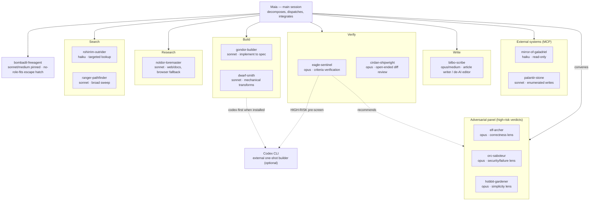

# TLOR Orchestration — a Middle-earth fellowship for Claude Code

An orchestration framework for [Claude Code](https://code.claude.com), themed
on Middle-earth. Fourteen subagent roles, thirteen with fixed model/effort/tools,
plus dispatch rules, setup skills, and opt-in guard hooks. The point is to make
delegation reliable enough that a coding session can depend on it.

繁體中文說明請見 [README.zh-TW.md](README.zh-TW.md).

## The fellowship at a glance

## Skills at a glance

### Autoloaded (installed automatically with the plugin/agents)

| Skill | Purpose | When to invoke |
|---|---|---|
| `/rivendell-council` | Convene the adversarial panel (3 lenses, majority-survival verdict) | Irreversible ops, architecture decisions, root-cause verdicts, security judgments |
| `/tlor-init` | Install agents + rules + CLAUDE.md/AGENTS.md routing + optional hooks | First-time setup, or upgrading an existing installation |
| `/tlor-restore` | Rollback to a previous installation from backup | An upgrade needs undoing |
| `/erebor-ledger` | Retrospective token/cost-savings report for tlor role dispatching, split by Fable-5- vs Opus-orchestrator sessions | "usage report", "cost savings report", "token ledger" — not for live in-progress cost estimation |
| `/westmarch-scribe` | Archive a filled compact-MADR decision to the project's decision log / instruction file / general decisions log | Advisory closing step of stdd-explore/uiux/spec/plan, directly after a durable decision, or proactively on decision-keywords in conversation (both require the tlor rules layer installed, i.e. `/tlor-init` run first) |
| `/minas-tirith-archivist` | Read-only query counterpart to `/westmarch-scribe` — searches archived decision records (general and project-scoped) and answers with citations, never writes or edits | Asking about past decisions or why a convention exists, or directly by the user (also requires the tlor rules layer installed) |

## Code-enforced STDD workflow (opt-in)

Two files enforce the STDD execute phase's approval-custody chain and
verifier-round cap in code rather than in prose: the Workflow script
`workflows/stdd-execute.js`, and its runtime dependency
`scripts/stdd_custody_check.py`, the custody/fingerprint verdict program it
relays to. [Skills](docs/en/skills.md) has the detail.
`install.sh`/`/tlor-init` copy both to `~/.claude/workflows/` and
`~/.claude/scripts/` (or the project/repo-level equivalent). An install done
only via `claude plugin add` also finds them through the plugin's own
installed directory (`custodyCheck`'s search-location list).

## Docs

- [Roles & dispatch](docs/en/roles.md) — the worldview, the fourteen-role fellowship, subagent dispatch snippet
- [Skills](docs/en/skills.md) — full skill detail + the opt-in STDD workflow
- [Rules & hooks](docs/en/rules-and-hooks.md) — the bundled rules files, the agent_doc lazy-load layer, the four opt-in hooks
- [Installation](docs/en/installation.md) — the two install paths, ownership model, install flags
- [Maintenance](docs/en/maintenance.md) — notes, honest limits, releasing
- [History](docs/en/history.md) — project rename history and the versioning reset
- [STDD reviews](docs/en/stdd-reviews/statusline.md) — per-project full-cycle retrospectives with token accounting
- [Release log](docs/release_log.md) — full version-by-version history (English only)

## License & homage

MIT © [twjohnwu](https://github.com/twjohnwu). A fan homage to
J.R.R. Tolkien's legendarium; not affiliated with or endorsed by the Tolkien
Estate or Middle-earth Enterprises. Race and role names are used
thematically. The rivendell-council convening flow is inspired by adversarial-review,
[Miguok/fable-harness](https://github.com/Miguok/fable-harness) (MIT).
