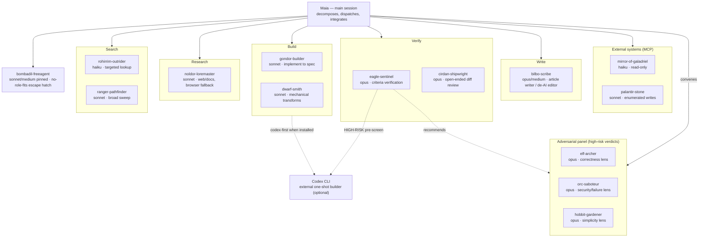

# TLOR Orchestration — subagent roles and dispatch rules for Claude Code

TLOR gives [Claude Code](https://code.claude.com) a fixed roster of subagent
roles and the rules for handing work to them. Fourteen roles ship with the
plugin. Each one pins a model and an effort level, and thirteen also pin their
tool set, so the cost and the permissions of a dispatch are settled before you
send it. Dispatch rules, setup skills, and opt-in guard hooks come with them.

TLOR combines specification-driven development, BDD-style example and scenario
discovery, and TDD-based execution with independent verification.

The role names come from Middle-earth. That part is decoration — the table
below leads with each role's function, so the roster reads without any
knowledge of the source material.

繁體中文說明請見 [README.zh-TW.md](README.zh-TW.md).

## The roles at a glance

Each row says what the role does first, then gives its name and pinned model.
The diagram after the table groups the same roster and shows how the main
session dispatches to it.

| What it does | Role | Model | Use when |
|---|---|---|---|
| Targeted lookup of a known symbol/file | rohirrim-outrider | haiku | "Where is X" — exact name, cheap search |
| Broad/ambiguous sweep where a miss is costly | ranger-pathfinder | sonnet | Repo-wide search with no exact target |
| Web/docs research, browser fallback | noldor-loremaster | sonnet | Version checks, source-cited answers, SPA research |
| Implements a clear spec | gondor-builder | sonnet | Feature/change with checkable acceptance criteria |
| Mechanical batch transforms | dwarf-smith | sonnet | Exact recipe applied across many files |
| Verifies a diff against stated criteria | eagle-sentinel | opus | Fresh-context read-back, high-risk verification |
| Open-ended review of a diff | cirdan-shipwright | opus | No criteria list, production-readiness judgment call |
| Writes/edits prose | bilbo-scribe | opus/medium | Professional articles, de-AI editing |
| Read-only external-system queries | mirror-of-galadriel | haiku | MCP reads against trackers/docs stores |
| Enumerated external-system writes | palantir-stone | sonnet | MCP writes — T1, needs explicit user confirmation first |
| Correctness lens in the adversarial panel | elf-archer | opus | Panel convening, correctness angle |
| Security/failure lens in the adversarial panel | orc-saboteur | opus | Panel convening, security/failure angle |
| Simplicity lens in the adversarial panel | hobbit-gardener | opus | Panel convening, simplicity angle |
| No-role-fits escape hatch | bombadil-freeagent | sonnet/medium (pinned) | Task shape doesn't match any other role |

```mermaid
flowchart TD
    M["Maia — main session<br/>decomposes, dispatches, integrates"]

    subgraph SEARCH["Search"]
        RO["rohirrim-outrider<br/>haiku · targeted lookup"]
        RP["ranger-pathfinder<br/>sonnet · broad sweep"]
    end
    subgraph RESEARCH["Research"]
        NL["noldor-loremaster<br/>sonnet · web/docs, browser fallback"]
    end
    subgraph BUILD["Build"]
        GB["gondor-builder<br/>sonnet · implement to spec"]
        DS["dwarf-smith<br/>sonnet · mechanical transforms"]
    end
    subgraph VERIFY["Verify"]
        ES["eagle-sentinel<br/>opus · criteria verification"]
        CS["cirdan-shipwright<br/>opus · open-ended diff review"]
    end
    subgraph WRITE["Write"]
        BS["bilbo-scribe<br/>opus/medium · article writer / de-AI editor"]
    end
    subgraph MCP["External systems (MCP)"]
        MG["mirror-of-galadriel<br/>haiku · read-only"]
        PS["palantir-stone<br/>sonnet · enumerated writes"]
    end
    subgraph PANEL["Adversarial panel (high-risk verdicts)"]
        EA["elf-archer<br/>opus · correctness lens"]
        OSB["orc-saboteur<br/>opus · security/failure lens"]
        HG["hobbit-gardener<br/>opus · simplicity lens"]
    end
    BF["bombadil-freeagent<br/>sonnet/medium pinned · no-role-fits escape hatch"]
    CX["Codex CLI<br/>external one-shot builder (optional)"]

    M --> SEARCH
    M --> RESEARCH
    M --> BUILD
    M --> VERIFY
    M --> WRITE
    M --> MCP
    M --> BF
    ES -. recommends .-> PANEL
    M -- convenes --> PANEL
    BUILD -. "codex-first when installed" .-> CX
    ES -. "HIGH-RISK pre-screen" .-> CX
```

## Skills at a glance

### Autoloaded (installed automatically with the plugin/agents)

| Skill | Purpose | When to invoke |
|---|---|---|
| `/rivendell-council` | Convene the adversarial panel (3 lenses, majority-survival verdict) | Irreversible ops, architecture decisions, root-cause verdicts, security judgments |
| `/tlor-init` | Install agents + rules + CLAUDE.md/AGENTS.md routing + optional hooks | First-time setup, or upgrading an existing installation |
| `/tlor-restore` | Rollback to a previous installation from backup | An upgrade needs undoing |
| `/erebor-ledger` | Retrospective token/cost-savings report for tlor role dispatching, split by Fable-5- vs Opus-orchestrator sessions | "usage report", "cost savings report", "token ledger" — not for live in-progress cost estimation |
| `/westmarch-scribe` | Archive a filled compact-MADR decision to the project's decision log / instruction file / general decisions log | Advisory closing step of stdd-explore/uiux/spec/plan, directly after a durable decision, or proactively on decision-keywords in conversation (both require the tlor rules layer installed, i.e. `/tlor-init` run first) |
| `/minas-tirith-archivist` | Read-only query counterpart to `/westmarch-scribe` — searches archived decision records (general and project-scoped) and answers with citations, never writes or edits | Asking about past decisions or why a convention exists, or directly by the user (also requires the tlor rules layer installed) |
| `/westron-plainspeech` | Plain-language pass for planning artifacts — ISO 24495 principles for plan prose, STE-flavored checks for dispatch prompts (checklist lives in `agent_doc/plan-writing.md`) | Named by dispatch.md's plan-mode requirements before the final plan write-up, or "plain-language plan" |

## Code-enforced STDD workflow (opt-in)

Two files hold the STDD execute phase's approval-custody chain and its
verifier-round cap in code rather than in prose: the Workflow script
`workflows/stdd-execute.js`, and the program it calls at runtime,
`scripts/stdd_custody_check.py`, which returns the custody/fingerprint verdict.
[Skills](docs/en/skills.md) has the detail.

`install.sh` and `/tlor-init` copy both files to `~/.claude/workflows/` and
`~/.claude/scripts/`, or to the project/repo-level equivalent. If you installed
only through `claude plugin add`, `custodyCheck` still finds them: the plugin's
own installed directory is on its search-location list.

The `## State model` section named in the STDD spec template is enforced at the
spec+lint (markdown) level only — there is no runtime state machine in the
`.py`/`.js` layer.

v0.12.0 adds a BDD layer that works at that same markdown level. `stdd-explore`
gains a conditional Example Map step; `stdd-spec` gains a conditional
`## Domain Language` section; the stdd-execute prompts carry an observable-THEN
rubric; `stdd-lint`'s Check 16 checks that a scenario's test mapping exists;
and the scenario runner `scripts/stdd_verify.py` turns a spec.md into a
per-scenario PASS/FAIL coverage report. When each conditional step applies is
in [Skills](docs/en/skills.md).

## Docs

- [Roles & dispatch](docs/en/roles.md) — all fourteen roles in full, the theme behind the names, and the CLAUDE.md dispatch snippet
- [Skills](docs/en/skills.md) — every skill in detail, plus the opt-in STDD workflow
- [Rules & hooks](docs/en/rules-and-hooks.md) — the bundled rules files, the agent_doc lazy-load layer, the four opt-in hooks
- [Installation](docs/en/installation.md) — the two install paths, who owns which file, the install flags
- [Maintenance](docs/en/maintenance.md) — notes, honest limits, how a release is cut
- [History](docs/en/history.md) — the project rename and the versioning reset
- [STDD reviews](docs/en/stdd-reviews/statusline.md) — per-project full-cycle retrospectives with token accounting
- [Release log](docs/release_log.md) — full version-by-version history (English only)

## License & homage

MIT © [twjohnwu](https://github.com/twjohnwu). A fan homage to
J.R.R. Tolkien's legendarium; not affiliated with or endorsed by the Tolkien
Estate or Middle-earth Enterprises. Race and role names are used
thematically. The rivendell-council convening flow is inspired by adversarial-review,
[Miguok/fable-harness](https://github.com/Miguok/fable-harness) (MIT).
