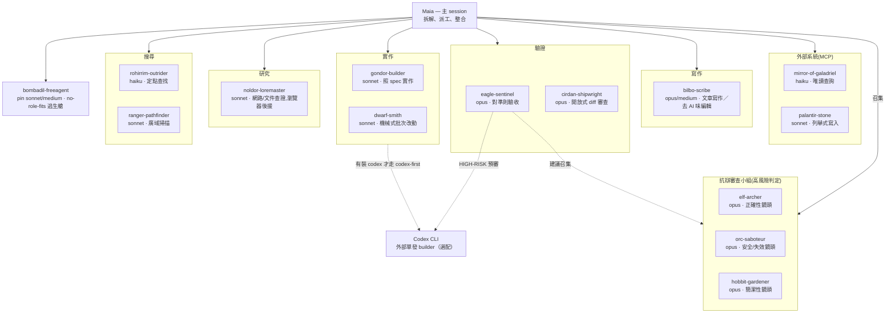

# TLOR Orchestration — 給 Claude Code 的中土遠征隊

中土世界主題的 Claude Code 編排框架：十四個 subagent 角色（其中十三個固定職責），加上派工規則、設定 skill，以及選配的 guard hook。要讓 AI coding session 可靠地把工作委派出去，需要的就是這些。

English version: [README.md](README.md).

## 團隊一覽

## Skills 一覽

### 自動載入（隨 plugin/agents 一起安裝）

| Skill | 用途 | 何時呼叫 |
|---|---|---|
| `/rivendell-council` | 召集抗辯小組（三鏡頭，多數存活制判定）| 不可逆操作、架構決策、根因判定、安全性判斷 |
| `/tlor-init` | 安裝 agents + rules + CLAUDE.md 路由 + AGENTS.md + 選配 hooks | 首次設定，或升級既有安裝 |
| `/tlor-restore` | 從備份還原到先前的安裝狀態 | 需要復原某次升級時 |
| `/erebor-ledger` | 回溯性報表：tlor 角色派工省下多少 token/成本，依 Fable-5-orchestrator 與 Opus-orchestrator session 分開統計 | 「usage report」「cost savings report」「token ledger」——非單次進行中派工的即時估算 |
| `/westmarch-scribe` | 將已填 Outcome 的精簡 MADR 決策歸檔至專案 decision log／instruction 檔／通用決策紀錄 | stdd-explore/uiux/spec/plan 的建議性收尾步驟、做出耐久決策後直接呼叫，或對話中出現決策關鍵詞時主動觸發（兩者都需先安裝 tlor rules 層，即先跑過 `/tlor-init`）|
| `/minas-tirith-archivist` | `/westmarch-scribe` 的唯讀查詢對應版——搜尋已歸檔的決策紀錄（通用與專案層級）並附引用回答，絕不寫入或編輯 | 詢問過去的決策或某個慣例的緣由，或使用者直接呼叫（同樣需先安裝 tlor rules 層）|
| `/westron-plainspeech` | 計畫工件的平語化檢核——plan 散文套 ISO 24495 四原則,dispatch prompt 套 STE 式檢核(清單本體在 `agent_doc/plan-writing.md`) | dispatch.md plan-mode requirements 在寫最終 plan 檔前指名,或「平語化計畫」 |

## Code-enforced STDD 工作流程（選配）

STDD execute 階段的核准 custody chain 與 verifier round cap 是用程式碼強制執行的，不是寫在 prose 裡。做這件事的是 Workflow script `workflows/stdd-execute.js`，以及它執行時轉呼的 custody／fingerprint 裁決程式 `scripts/stdd_custody_check.py`，細節見 [Skills](docs/zh-TW/skills.md)。

`install.sh` 與 `/tlor-init` 會把兩者複製到 `~/.claude/workflows/` 與 `~/.claude/scripts/`（或對應的 project/repo 層路徑）。環境若只跑過 `claude plugin add`、沒跑過 install.sh 或 tlor-init，`custodyCheck` 一樣找得到它們：plugin 自己的安裝目錄就在它的搜尋位置清單裡。

## 文件

- [角色與派工](docs/zh-TW/roles.md) — 世界觀、十四角色遠征隊名冊、subagent 派工 snippet
- [Skills](docs/zh-TW/skills.md) — 完整 skill 細節＋選配的 STDD 工作流程
- [Rules 與 Hooks](docs/zh-TW/rules-and-hooks.md) — 附帶的 rules 檔案、agent_doc 懶載入層、四個選配 hooks
- [安裝](docs/zh-TW/installation.md) — 兩種安裝方式、所有權模型、安裝旗標
- [維護](docs/zh-TW/maintenance.md) — 備註、誠實限制、發布流程
- [歷史](docs/zh-TW/history.md) — 專案更名沿革與版本重置
- [STDD reviews](docs/zh-TW/stdd-reviews/statusline.md) — 各專案的完整週期回顧與 token 核算
- [Release log](docs/release_log.md) — 完整逐版本紀錄（僅英文）

## 授權與致敬

MIT © [twjohnwu](https://github.com/twjohnwu)。本專案為對托爾金傳說體系的粉絲致敬，與 Tolkien Estate 及 Middle-earth Enterprises 皆無關、未獲其背書；種族與角色名僅作主題性使用。
瑞文戴爾會議（rivendell-council）的召集流程靈感來自 adversarial-review， [Miguok/fable-harness](https://github.com/Miguok/fable-harness)（MIT）。
