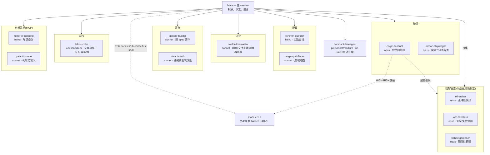

# TLOR Orchestration — 給 Claude Code 的 subagent 角色與派工規則

TLOR 給 [Claude Code](https://code.claude.com) 一組固定的 subagent 角色，以及把工作交出去的派工規則。plugin 內含十四個角色，另附一個 `Explore` 備援鏡像（dispatch guard 關閉時才會用到）。每個角色都釘住模型與 effort，其中十三個連可用工具也釘住，所以一次派工的成本與權限在送出前就決定好了。除了角色，還附派工規則、負責安裝設定的 skill，以及選配的 guard hook。

TLOR 把 specification-driven development、BDD 式的 example 與 scenario 探索，以及搭配獨立驗證的 TDD 執行流程整合在一起。

角色名稱取自中土世界，階層設計也是：Maia 不下場做事，所以主 session 只分析需求與派工，實作交給各角色；每個名字都對應該人物在原著裡做的事。不熟原著也讀得懂——下表把職能寫在第一欄。

English version: [README.md](README.md).

## 角色一覽

每一列先講這個角色做什麼，再列出名稱與釘住的模型。表格後面的圖把同一組角色分組，並畫出主 session 如何派工給它們。

| 職能 | 角色 | 模型 | 何時用 |
|---|---|---|---|
| 定點查找已知 symbol/file | rohirrim-outrider | haiku | 「東西在哪」——名稱明確、成本低的查找 |
| 廣域／模糊掃描,漏查代價高 | ranger-pathfinder | sonnet | 沒有明確目標的全 repo 搜尋 |
| 網路/文件查證,瀏覽器後援 | noldor-loremaster | sonnet | 版本確認、附來源的答案、SPA 研究 |
| 照 spec 實作 | gondor-builder | sonnet | 有可驗收準則的功能/改動 |
| 機械式批次改動 | dwarf-smith | sonnet | 有精確 recipe、套用到多個檔案 |
| 對準則驗收 diff | eagle-sentinel | opus | 新鮮視角讀回驗證、高風險驗收 |
| 開放式審查 diff | cirdan-shipwright | opus | 沒有準則清單,判斷是否可上線 |
| 撰寫／編輯文字 | bilbo-scribe | opus/medium | 專業文章、去 AI 味編輯 |
| 唯讀查詢外部系統 | mirror-of-galadriel | haiku | 對 tracker/文件庫的 MCP 讀取 |
| 列舉式寫入外部系統 | palantir-stone | sonnet | MCP 寫入——T1,派工前需使用者明確確認 |
| 抗辯小組的正確性鏡頭 | elf-archer | opus | 召集小組時的正確性角度 |
| 抗辯小組的安全/失效鏡頭 | orc-saboteur | opus | 召集小組時的安全/失效角度 |
| 抗辯小組的簡潔性鏡頭 | hobbit-gardener | opus | 召集小組時的簡潔性角度 |
| no-role-fits 逃生艙 | bombadil-freeagent | pin sonnet/medium | 任務形狀不合任何既有角色 |

```mermaid
flowchart TD
    M["Maia — 主 session<br/>拆解、派工、整合"]

    subgraph SEARCH["搜尋"]
        RO["rohirrim-outrider<br/>haiku · 定點查找"]
        RP["ranger-pathfinder<br/>sonnet · 廣域掃描"]
    end
    subgraph RESEARCH["研究"]
        NL["noldor-loremaster<br/>sonnet · 網路/文件查證,瀏覽器後援"]
    end
    subgraph BUILD["實作"]
        GB["gondor-builder<br/>sonnet · 照 spec 實作"]
        DS["dwarf-smith<br/>sonnet · 機械式批次改動"]
    end
    subgraph VERIFY["驗證"]
        ES["eagle-sentinel<br/>opus · 對準則驗收"]
        CS["cirdan-shipwright<br/>opus · 開放式 diff 審查"]
    end
    subgraph WRITE["寫作"]
        BS["bilbo-scribe<br/>opus/medium · 文章寫作／去 AI 味編輯"]
    end
    subgraph MCP["外部系統(MCP)"]
        MG["mirror-of-galadriel<br/>haiku · 唯讀查詢"]
        PS["palantir-stone<br/>sonnet · 列舉式寫入"]
    end
    subgraph PANEL["抗辯審查小組(高風險判定)"]
        EA["elf-archer<br/>opus · 正確性鏡頭"]
        OSB["orc-saboteur<br/>opus · 安全/失效鏡頭"]
        HG["hobbit-gardener<br/>opus · 簡潔性鏡頭"]
    end
    BF["bombadil-freeagent<br/>pin sonnet/medium · no-role-fits 逃生艙"]
    CX["Codex CLI<br/>外部單發 builder（選配）"]

    M --> SEARCH
    M --> RESEARCH
    M --> BUILD
    M --> VERIFY
    M --> WRITE
    M --> MCP
    M --> BF
    ES -. 建議召集 .-> PANEL
    M -- 召集 --> PANEL
    M -. "有裝 codex 才走 codex-first（§3d）" .-> CX
    ES -. "HIGH-RISK 預審" .-> CX
```

## Skills 一覽

### 自動載入（隨 plugin/agents 一起安裝）

| Skill | 用途 | 何時呼叫 |
|---|---|---|
| `/rivendell-council` | 召集抗辯小組（三鏡頭，多數存活制判定）| 不可逆操作、架構決策、根因判定、安全性判斷 |
| `/tlor-init` | 安裝 agents + rules + CLAUDE.md 路由 + AGENTS.md + 選配 hooks | 首次設定，或升級既有安裝 |
| `/tlor-restore` | 從備份還原到先前的安裝狀態 | 需要復原某次升級時 |
| `/erebor-ledger` | 回溯性報表：tlor 角色派工省下多少 token/成本，依 Fable-5-orchestrator 與 Opus-orchestrator session 分開統計 | 「usage report」「cost savings report」「token ledger」——非單次進行中派工的即時估算 |
| `/westmarch-scribe` | 將已填 Outcome 的精簡 MADR 決策歸檔至專案 decision log／instruction 檔／通用決策紀錄 | stdd-explore/uiux/spec/plan 的建議性收尾步驟、做出耐久決策後直接呼叫，或對話中出現決策關鍵詞時主動觸發（兩者都需先安裝 tlor rules 層，即先跑過 `/tlor-init`）|
| `/minas-tirith-archivist` | `/westmarch-scribe` 的唯讀查詢對應版——搜尋已歸檔的決策紀錄（通用與專案層級）並附引用回答，絕不寫入或編輯 | 詢問過去的決策或某個慣例的緣由，或使用者直接呼叫（同樣需先安裝 tlor rules 層）|
| `/westron-plainspeech` | 計畫工件的平語化檢核——plan 散文套 ISO 24495 四原則,dispatch prompt 套 STE 式檢核(清單本體在 `agent_doc/plan-writing.md`) | dispatch.md plan-mode requirements 在寫最終 plan 檔前指名,或「平語化計畫」 |

## Code-enforced STDD 工作流程（選配）

STDD execute 階段的核准 custody chain 與 verifier round cap 寫在程式碼裡，不是寫在 prose 裡。負責的是兩個檔案：Workflow script `workflows/stdd-execute.js`，以及它執行時轉呼、負責給出 custody／fingerprint 裁決的 `scripts/stdd_custody_check.py`。細節見 [Skills](docs/zh-TW/skills.md)。

`install.sh` 與 `/tlor-init` 會把兩個檔案複製到 `~/.claude/workflows/` 與 `~/.claude/scripts/`，或對應的 project／repo 層路徑。只跑過 `claude plugin add` 的環境也不受影響：plugin 自己的安裝目錄就在 `custodyCheck` 的搜尋位置清單裡。

STDD spec 範本中的 `## State model` 一節只在 spec+lint（markdown）層面強制執行，`.py`／`.js` 程式碼層並沒有對應的 runtime state machine。

v0.12.0 在同一個 markdown 層之上加了一層 BDD：`stdd-explore` 多了條件性的 Example Map 步驟，`stdd-spec` 多了條件性的 `## Domain Language` 一節，stdd-execute 的 prompt 帶著 observable-THEN 準則，`stdd-lint` 的 Check 16 檢查 scenario 的 test mapping 是否存在，新的 scenario runner `scripts/stdd_verify.py` 則把一份 spec.md 轉成逐 scenario 的 PASS／FAIL 涵蓋率報表。兩個條件性步驟各自在什麼情況下適用，見 [Skills](docs/zh-TW/skills.md)。

## 文件

- [角色與派工](docs/zh-TW/roles.md) — 十四個角色（另含 Explore 備援鏡像）的完整說明、名稱背後的世界觀，以及 CLAUDE.md 的派工 snippet
- [Skills](docs/zh-TW/skills.md) — 每個 skill 的完整細節，以及選配的 STDD 工作流程
- [Rules 與 Hooks](docs/zh-TW/rules-and-hooks.md) — 附帶的 rules 檔案、agent_doc 懶載入層、四個選配 hooks
- [安裝](docs/zh-TW/installation.md) — 兩種安裝方式、哪個檔案歸誰管、安裝旗標，以及選配的 Serena／Codex
- [維護](docs/zh-TW/maintenance.md) — 備註、誠實限制、怎麼發一個版本
- [歷史](docs/zh-TW/history.md) — 專案更名與版本重置
- [STDD reviews](docs/zh-TW/stdd-reviews/statusline.md) — 各專案的完整週期回顧與 token 核算
- [Release log](docs/release_log.md) — 完整逐版本紀錄（僅英文）

## 授權與致敬

MIT © [twjohnwu](https://github.com/twjohnwu)。本專案為對托爾金傳說體系的粉絲致敬，與 Tolkien Estate 及 Middle-earth Enterprises 皆無關、未獲其背書；種族與角色名僅作主題性使用。
瑞文戴爾會議（rivendell-council）的召集流程靈感來自 adversarial-review， [Miguok/fable-harness](https://github.com/Miguok/fable-harness)（MIT）。
