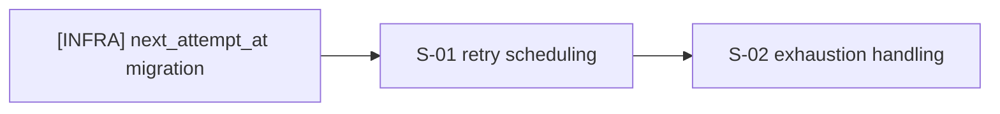

# tasks: Webhook Retry Queue

## Requirements Checklist

- [x] Retry scheduling with exponential backoff (REQ-01)
- [x] Exhaustion marks delivery failed (REQ-01)
- [ ] System-boundary diagram reviewed against real dependency graph (REQ-02)

## Tasks

- [x] `S-01` `[NEW]` Retry scheduling on 5xx response
  - RED: write `tests/webhook/test_retry_scheduling.py::test_5xx_schedules_retry`
    asserting a retry is enqueued with the correct backoff delay
  - Verify RED: `pytest tests/webhook/test_retry_scheduling.py::test_5xx_schedules_retry -q`
    fails (no scheduling logic yet)
  - GREEN: implement `schedule_retry()` in `webhook/worker.py`
  - Verify GREEN: `pytest tests/webhook/test_retry_scheduling.py::test_5xx_schedules_retry -q`
    passes
  - REFACTOR: check `schedule_retry()` against SOLID (single responsibility:
    backoff math only) + DRY (reuse the existing `Delivery` model, don't
    duplicate its status enum)
  - Spec re-check: re-read `spec.md` S-01, confirm the implementation still
    matches the GIVEN/WHEN/THEN

- [ ] `S-02` `[MODIFY]` Exhausted retries mark delivery failed
  - Existing target: `webhook/worker.py:schedule_retry` (the file survey
    found this function already implements the retry path; this task adds
    the exhaustion branch to it)
  - RED: write `tests/webhook/test_retry_scheduling.py::test_exhausted_retries_marks_failed`
  - Verify RED: `pytest tests/webhook/test_retry_scheduling.py::test_exhausted_retries_marks_failed -q`
    fails
  - GREEN: implement the `attempt == 5` branch in `schedule_retry()`
  - Verify GREEN: `pytest tests/webhook/test_retry_scheduling.py::test_exhausted_retries_marks_failed -q`
    passes
  - REFACTOR: SOLID + DRY check as above
  - Spec re-check: re-read `spec.md` S-02

- `[INFRA]` Add `next_attempt_at` column migration
  - Reason: schema change with no scenario ID of its own; required by both
    S-01 and S-02's implementation, not itself a testable behavior.

- `[MANUAL]` `S-03` Review the C1/C2 system-boundary diagram for accuracy
  - Reason: diagram review is a human judgment call, not something a test
    asserts — listed in the Manual verification checklist below.

## Manual verification checklist

- [ ] `S-03`: confirm the C1/C2 diagram in `spec.md` matches the actual
  delivery-worker dependency graph (no missing/extra external calls).

## Task dependency (optional)

This is a dependency graph only, no timeline/duration is implied (banned
Mermaid constructs: single source of truth is `stdd-lint`'s
`references/checklist.md` — not restated here).
